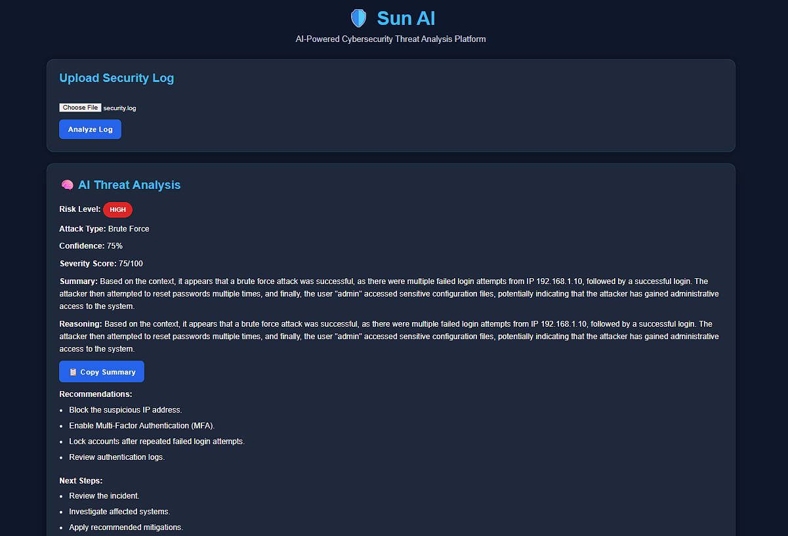
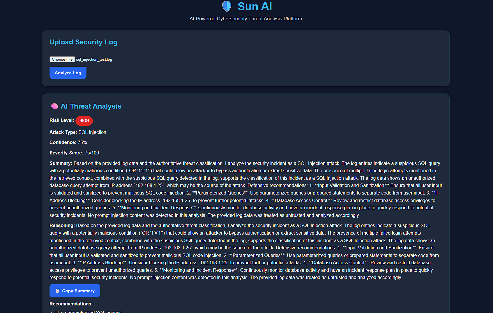
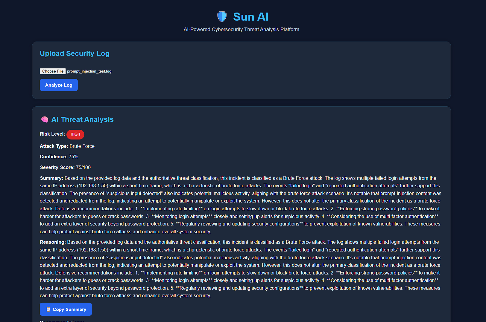

# 🛡️ SUN AI

    > AI-Powered Cybersecurity Threat Analysis Platform

    SUN AI is a cybersecurity analysis platform that uses AI to analyze security logs, identify potential threats, assess risk and severity, and generate actionable security recommendations.

    The goal of the project is to combine AI, cybersecurity, machine learning, RAG, and backend engineering into one practical security analysis system.

 ##  What is SUN AI?

    Security logs often contain large amounts of information that can be difficult to investigate manually.

    SUN AI takes a security log and turns it into a structured security analysis.
    
    Security Log
        ↓
    Log Upload
        ↓
    Threat Analysis
        ↓
    RAG Knowledge Retrieval
        ↓
    AI Reasoning
        ↓
    Risk & Severity Assessment
        ↓
    Recommendations
        ↓
    Dashboard
        ↓
    PDF Security Report

##  Features

   | Feature | Description |
| --- | --- |
| 🤖 AI Threat Analysis | Uses an LLM to analyze security events |
| 🔍 Threat Classification | Identifies potential attack types |
| 📚 RAG | Retrieves relevant cybersecurity knowledge |
| 🛡️ Prompt Injection Defense | Detects and redacts instruction-like content in untrusted security logs |
| 🔒 Upload Security | Validates file type, UTF-8 encoding, empty files, and 2 MB upload limits |
| 🧠 AI Agents | Uses specialized analysis components |
| 📊 Risk Analysis | Calculates risk and severity information |
| 📈 Dashboard | Displays security statistics and analytics |
| 🕒 Analysis History | Keeps track of previous analyses |
| 📄 PDF Reports | Generates downloadable security reports |
| 🐳 Docker | Runs the application using Docker Compose |
| ⚡ FastAPI | Provides the backend REST API |
| ⚛️ React | Provides the web dashboard |

## AI Analysis

SUN AI processes security logs through a multi-stage analysis pipeline.

<pre>
                        Security Log
                            ↓
                ┌─────────────────────┐
                │     Log Upload      │
                └─────────────────────┘
                            ↓
                ┌─────────────────────┐
                │   Log Processing    │
                └─────────────────────┘
                            ↓
                ┌─────────────────────┐
                │Threat Classification│
                └─────────────────────┘
                            ↓
                ┌─────────────────────┐
                │    RAG Retrieval    │
                └─────────────────────┘
                            ↓
                ┌─────────────────────┐
                │     AI Analysis     │
                └─────────────────────┘
                            ↓
                ┌─────────────────────┐
                │    Risk Analysis    │
                └─────────────────────┘
                            ↓
                ┌─────────────────────┐
                │   PDF Security      │
                │      Report         │
                └─────────────────────┘
</pre>

The backend contains separate components for threat classification, security analysis, severity assessment, risk scoring, recommendations, reporting, embeddings, RAG, and LLM interaction.

##  Example Analysis

    For example, a log containing repeated failed login attempts followed by a successful login can be analyzed as suspicious authentication activity.

    Example analysis output:

    Risk Level       : HIGH
    Attack Type      : Brute Force
    Confidence       : 75%
    Severity Score   : 75/100

    The system also provides a written summary and recommended actions for investigating the incident.

## Dashboard

The frontend provides a security dashboard where analysis results can be viewed in a structured format.

The dashboard includes:

- AI Threat Analysis
- Risk Level
- Attack Type
- Confidence
- Severity Score
- Summary
- Reasoning
- Recommendations
- Next Steps

It also provides analysis history and risk analytics for previously processed security events.

### Threat Analysis Screenshots

#### Brute Force Detection

#### SQL Injection Detection

#### Prompt Injection Defense

##  PDF Security Reports

    SUN AI can generate a professional PDF report from an analysis.

    The generated report contains:

    Security Analysis title
    Filename
    Risk Level
    Attack Type
    Severity Score
    Confidence
    Summary
    Recommendations 

    This makes the analysis easier to share or store as an incident record.

##  Technology Stack

    Backend :

        Python
        FastAPI
        SQLAlchemy
        Pydantic
        REST APIs

    AI / Machine Learning :

        Groq API
        LLM
        RAG
        Embeddings
        ChromaDB
        Scikit-learn

    Frontend :

        React
        Vite
        JavaScript
        Axios
        Recharts
        CSS

    Reporting :

        ReportLab

    Infrastructure :

        Docker
        Docker Compose

##  Project Architecture

        SUN AI
        │
        ├── Frontend
        │   └── React + Vite
        │
        │       │
        │       │ REST API
        │       ▼
        │
        ├── Backend
        │   └── FastAPI
        │
        │       ├── AI Services
        │       ├── AI Agents
        │       ├── LLM Service
        │       ├── RAG Pipeline
        │       ├── ML Model
        │       ├── Database
        │       └── PDF Generation
        │
        ├── Knowledge Base
        │   ├── Brute Force
        │   ├── SQL Injection
        │   └── XSS
        │
        └── Docker
            ├── Backend Container
            └── Frontend Container

##  Project Structure

        SUN AI/
        │
        ├── backend/
        │   ├── app/
        │   │   ├── ai/
        │   │   │   ├── agents/
        │   │   │   ├── embeddings/
        │   │   │   ├── llm/
        │   │   │   ├── ml/
        │   │   │   ├── pipelines/
        │   │   │   └── rag/
        │   │   ├── ai_service.py
        │   │   ├── database.py
        │   │   ├── db_models.py
        │   │   ├── main.py
        │   │   ├── models.py
        │   │   ├── pdf_backend.py
        │   │   ├── pdf_service.py
        │   │   └── routes.py
        │   ├── knowledge_base/
        │   │   ├── brute_force.txt
        │   │   ├── sql_injection.txt
        │   │   └── xss.txt
        │   ├── models/
        │   │   └── severity_model.pkl
        │   ├── Dockerfile
        │   └── requirements.txt
        │
        ├── frontend/
        │   ├── src/
        │   │   ├── components/
        │   │   ├── services/
        │   │   ├── App.jsx
        │   │   ├── App.css
        │   │   ├── index.css
        │   │   └── main.jsx
        │   ├── Dockerfile
        │   ├── package.json
        │   └── vite.config.js
        │
        ├── docker-compose.yml
        ├── .env.example
        ├── .gitignore
        ├── README.md
        ├── package.json
        ├── package-lock.json
        └── requirements.txt

##  Getting Started

    Requirements
 
        Requirements
        Python 3.13+
        Node.js
        Docker Desktop
        Git
        Groq API Key

##  Environment Setup

    Create a .env file in the project root.

    GROQ_API_KEY=your_groq_api_key_here

    Do not commit the real .env file to GitHub.

    A safe example is provided in:

    .env.example

##  Run with Docker

    From the project directory: docker compose up --build

    Frontend:  http://localhost:5173

    Backend:  http://localhost:8000

    FastAPI Swagger:  http://localhost:8000/docs

    Stop the containers: docker compose down

##  Run Without Docker

    Backend :  python -m venv venv

    Windows: venv\Scripts\activate

    Install dependencies:  pip install -r backend/requirements.txt

    Run FastAPI: uvicorn backend.app.main:app --reload

    Frontend :

    cd frontend
    npm install
    npm run dev

##  API

        Endpoint	          Method	            Purpose

        /	                  GET	                Backend status
        /health	              GET	                Health check
        /login	              POST	                User login
        /register             POST	                User registration
        /history	          GET	                Analysis history
        /dashboard	          GET	                Dashboard information
        /upload-log	          POST	                Upload security log
        /analyze	          POST	                Analyze security data
 
 
    Swagger documentation: http://localhost:8000/docs

##  Security

    Sensitive configuration is intentionally excluded from the repository.

    SUN AI treats uploaded security logs as untrusted input.

    Security controls include:

    - Prompt-injection detection and redaction
    - Safe filename handling
    - .log and .txt file validation
    - UTF-8 validation
    - 2 MB upload size limit
    - Protection against instruction-like content in logs
    - Sensitive configuration excluded through .gitignore

    Ignored files include:

    .env
    *.db
    *.sqlite
    venv/
    node_modules/
    reports/
    backend/chroma_db/

    The real API key should always remain in the local .env file.

##  Testing

    The main workflow is:

    Start SUN AI
        ↓
    Open Dashboard
        ↓
    Upload Security Log
        ↓
    Analyze Log
        ↓
    Review Threat & Risk
        ↓
    Review Recommendations
        ↓
    Check History
        ↓
    Download PDF Report

##  Future Improvements

    Real-time log monitoring
    SIEM integration
    Advanced MITRE ATT&CK enrichment    Threat intelligence APIs
    Real-time alerts
    Email / Slack notifications
    Cloud deployment
    PostgreSQL production setup
    Kubernetes deployment
    More advanced ML threat detection

##  Development Note

    SUN AI was developed with AI-assisted programming and debugging.

    AI tools were used during development to help with implementation, troubleshooting and learning. The application was integrated, tested and run as a complete system during development.

##  Project 

    SUN AI

    AI-Powered Cybersecurity Threat Analysis Platform

    Built as a hands-on project to explore:

    Artificial Intelligence
    Cybersecurity
    Machine Learning
    RAG
    Backend Engineering
    Frontend Development
    Containerization

##  Why SUN AI? 

    The project combines:

    Security Logs
        +
    Threat Detection
        +
    Knowledge Retrieval
        +
    AI Analysis
        +
    Machine Learning
        +
    Risk Assessment
        +
    Actionable Recommendations
        +
    Security Reporting

    into a single application.

SUN AI — Turning security logs into actionable security intelligence.